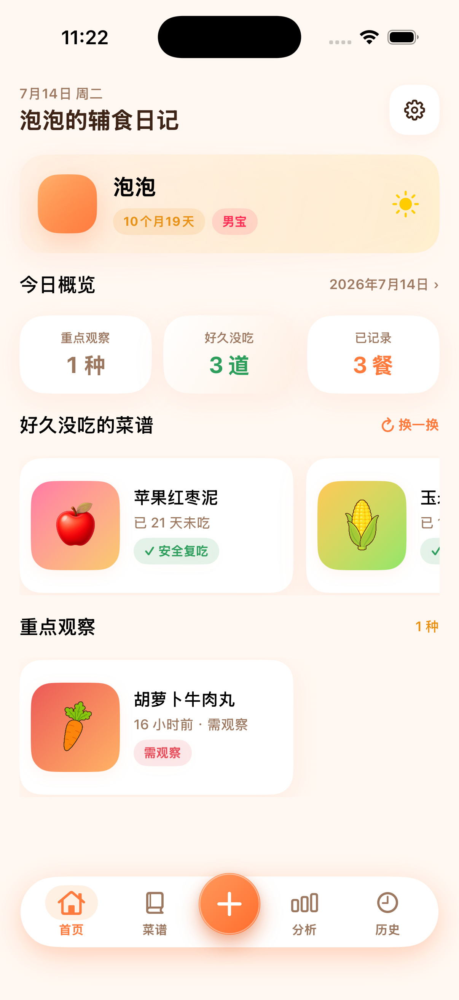
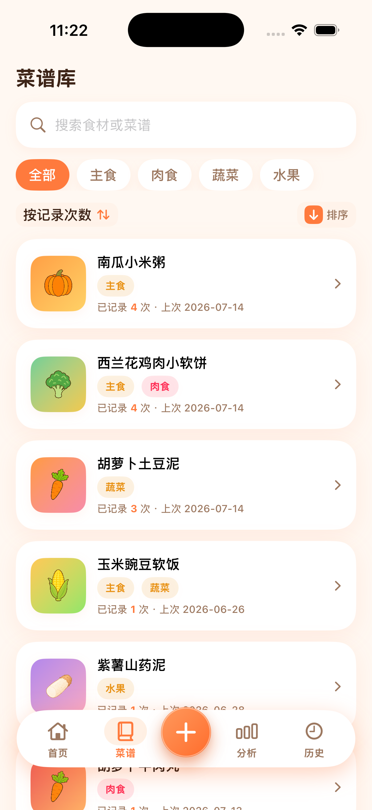
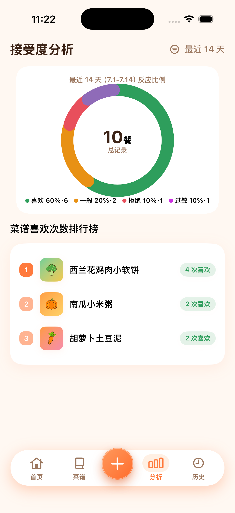
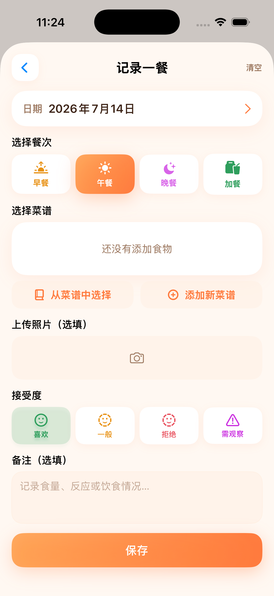

# 宝宝辅食日记

一款面向 iPhone 的本地优先辅食记录应用。用它记录每一餐吃了什么、宝宝的接受情况与成长中的饮食偏好，逐步形成清晰、可回溯的辅食档案。

> 本项目仅用于记录与整理饮食信息，不构成医疗、营养或过敏诊断建议。如出现疑似过敏或其他不适，请及时咨询专业医护人员。

## 功能一览

- **快捷记录每一餐**：支持早、中、晚餐与加餐；可添加多个食材/菜品、备注及照片。
- **反应追踪**：记录喜欢、一般、拒绝和“需观察”等反馈，并可为单个食材分别标注反应。
- **菜谱与食材库**：内置丰富的食材图标，可搜索、分类、新建并管理常用食材。
- **数据分析**：按时间范围查看用餐次数、接受程度和食材偏好排行，帮助发现饮食规律。
- **历史回顾**：以列表、照片网格与日历方式浏览既往记录。
- **宝宝档案**：维护昵称、生日、性别与头像，并自动计算月龄。
- **本地备份与恢复**：将资料及关联照片导出为 ZIP 备份包，换机或重装后可导入恢复。
- **隐私优先**：数据由 SwiftData 保存在设备本地；项目不依赖第三方服务。

## 预览

以下截图来自 iPhone 17 Pro 模拟器，展示应用的主要界面与数据管理页面。

| 首页 | 菜谱库 | 接受度分析 |
| --- | --- | --- |
|  |  |  |

| 历史记录 | 记录一餐 | 设置与备份 |
| --- | --- | --- |
|  |  |  |

## 技术栈

| 项目 | 说明 |
| --- | --- |
| UI | SwiftUI |
| 数据持久化 | SwiftData |
| 图片与媒体 | Photos / PhotosUI |
| 备份格式 | ZIP（内含 JSON 数据和照片资源） |
| 支持平台 | iOS 17.0+（iPhone） |
| 外部依赖 | 无 |

## 开始使用

### 环境要求

- macOS
- Xcode 15 或更高版本
- iOS 17.0 或更高版本的 iPhone 模拟器或真机

### 构建与运行

1. 克隆仓库：

   ```bash
   git clone https://github.com/randian666/BabyFoodDiary.git
   cd BabyFoodDiary
   ```

2. 使用 Xcode 打开项目：

   ```bash
   open BabyFoodDiary/BabyFoodDiary.xcodeproj
   ```

3. 在 Xcode 中选择 `BabyFoodDiary` scheme 和目标模拟器或设备，按 <kbd>⌘</kbd><kbd>R</kbd> 运行。

首次启动会写入少量示例菜谱，方便体验记录流程；之后添加的数据均保存在本机。

## 数据备份

在应用的“设置”中可导出或导入备份：

1. 点击“导出备份”，通过系统分享面板保存 `baby-food-diary-backup.zip`。
2. 妥善保存该文件；它可能包含宝宝资料与照片。
3. 在新设备或重装后的应用中选择“导入备份”，并确认导入同一 ZIP 文件。

建议在换机、清理应用或进行较大版本升级前手动导出一次备份。

## 项目结构

```text
BabyFoodDiary/
├── BabyFoodDiary.xcodeproj/     # Xcode 工程
├── BabyFoodDiary/
│   ├── App/                     # 应用入口与 SwiftUI 页面
│   ├── Data/                    # 数据仓库、种子数据与备份归档
│   ├── Design/                  # 主题与视觉样式
│   ├── Models/                  # SwiftData 持久化模型
│   └── FoodIcons.xcassets/      # 食材图标和应用图标
└── BabyFoodDiaryTests/          # 单元测试
```

## 贡献

欢迎通过 Issue 反馈问题、提出想法，或通过 Pull Request 提交改进。提交前请确保：

- 改动聚焦且说明清楚；
- 使用 Xcode 构建通过；
- 为新增逻辑补充或更新必要测试；
- 不提交个人数据、导出的备份文件或其他敏感内容。

## 许可证

当前仓库尚未附带许可证文件。在许可证明确前，请勿将本项目或其素材用于超出 GitHub 浏览、学习与协作贡献之外的用途。
